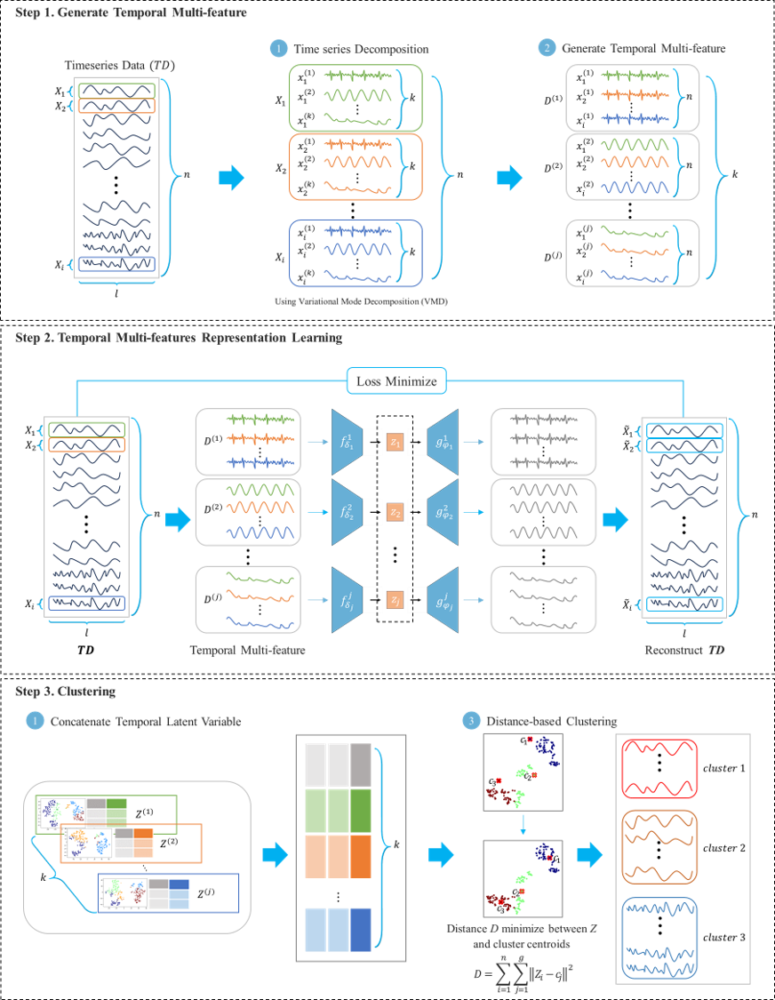

# TMRC: Temporal Multi-features Representation Learning-Based Clustering for Time-Series Data

A novel deep learning approach for time series clustering that combines **Variational Mode Decomposition (VMD)** with **LSTM Autoencoders** for temporal multi-features representation learning and enhanced clustering performance.

📄 **Paper**: [IEEE Xplore - Temporal Multi-features Representation Learning-Based Clustering for Time-Series Data](https://ieeexplore.ieee.org/abstract/document/10565866)

## 🏗️ TMRC Model Architecture

The TMRC model consists of three main components:

1. **VMD Decomposition**: Breaks down the input time series into K temporal features (intrinsic mode functions)
2. **LSTM Autoencoders**: Multiple autoencoders learn representations from each temporal feature independently
3. **Multi-features Fusion & Clustering**: Concatenates learned representations and performs TimeSeriesKMeans clustering



The TMRC approach enables learning of complementary temporal features at different frequency scales, providing richer representations for more accurate time series clustering.

## 🌟 Features

- **Temporal multi-features decomposition**: TMRC decomposes time series into multiple temporal features using VMD
- **Deep representation learning**: Employs LSTM Autoencoders to learn meaningful representations from each temporal feature
- **Multi-features fusion**: Combines learned representations from all temporal features for comprehensive clustering
- **Advanced time series clustering**: Performs clustering using TimeSeriesKMeans on fused multi-features representations
- **Comprehensive evaluation**: Uses Rand Index and Normalized Mutual Information metrics
- **Automated grid search**: Tests multiple hyperparameter combinations automatically
- **UCR/UEA dataset support**: Compatible with standard time series benchmarks

## 🚀 Quick Start

### For Windows Users

1. **Run all 36 datasets (full grid search)**:
   ```cmd
   run_experiments.bat
   ```

2. **Quick test (single run per dataset)**:
   ```cmd
   run_quick_test.bat
   ```

3. **Single dataset experiment**:
   ```cmd
   run_single_dataset.bat ECG200
   ```

### Manual Python Execution

**Basic usage:**
```bash
python main.py --dataset ECG200 --device cuda
```

**Grid search:**
```bash
python main.py --dataset ECG200 \
                --K_list 2 3 4 5 6 \
                --hidden_size_list 10 50 100 400 800 \
                --num_epochs 1001 \
                --output_dir results
```

## 📊 Supported Datasets

The scripts are configured to run on these 36 UCR datasets:

```
ArrowHead, Beef, BeetleFly, BirdChicken, Car, ChlorineConcentration, 
Coffee, DiatomsizeReduction, Dist.phal.outl.agegroup, 
Dist.phal.outl.correct, ECG200, ECGFiveDays, GunPoint, Ham, 
Herring, Lighting2, Meat, Mid.phal.outl.agegroup, 
Mid.phal.outl.correct, Mid.phal.TW, MoteStrain, OSULeaf, 
Plane, Prox.phal.outl.ageGroup, Prox.phal.TW, SonyAIBORobotSurface, 
SonyAIBORobotSurfaceII, SwedishLeaf, Symbols, ToeSegmentation1, 
ToeSegmentation2, TwoLeadECG, TwoPatterns, Wafer, Wine, WordsSynonyms
```

## ⚙️ Command Line Arguments

### Data Arguments
- `--dataset`: Dataset name from UCR/UEA archive (default: 'GunPoint')
- `--data_dir`: Path to dataset directory (default: 'datasets/UCR')
- `--dataset_list`: CSV file containing list of datasets to run

### Model Hyperparameters
- `--K_list`: List of VMD decomposition modes (default: [2,3,4,5,6])
- `--hidden_size_list`: List of LSTM hidden sizes (default: [10,50,100,400,800,1200,1600,2000])
- `--num_epochs`: Number of training epochs (default: 1001)
- `--lr`: Learning rate (default: 0.0002)
- `--num_layers`: Number of LSTM layers (default: 1)

### VMD Parameters
- `--vmd_alpha`: VMD bandwidth constraint (default: 2000)
- `--vmd_tau`: VMD noise-tolerance (default: 0.0)
- `--vmd_tol`: VMD convergence tolerance (default: 1e-7)

### Experiment Settings
- `--output_dir`: Directory to save results (default: 'results')
- `--device`: Device to use ('cuda' or 'cpu')
- `--seed`: Random seed for reproducibility (default: 42)
- `--verbose`: Print detailed progress
- `--single_run`: Run single experiment instead of grid search

## 📝 Citation

If you use TMRC in your research, please cite our paper:

```bibtex
@article{lee2024temporal,
  title={Temporal multi-features representation learning-based clustering for time-series data},
  author={Lee, Jaehoon and Kim, Dohee and Sim, Sunghyun},
  journal={IEEE Access},
  volume={12},
  pages={87675--87690},
  year={2024},
  publisher={IEEE},
  doi={10.1109/ACCESS.2024.3417888},
  url={https://ieeexplore.ieee.org/abstract/document/10565866}
}
```

## 📜 License

This project is licensed under the MIT License - see the [LICENSE](LICENSE) file for details.

## 🤝 Contributing

Contributions are welcome! Please feel free to submit a Pull Request.

## 📧 Contact

For questions or issues, please open an issue on GitHub or contact [dynamic97312@naver.com].

---

**Keywords**: Time Series Clustering, Deep Learning, LSTM Autoencoders, Variational Mode Decomposition, Temporal Features, Multi-scale Analysis